# blackhole

A general-relativistic ray tracer for the Kerr spacetime, in C++17, with no
dependencies beyond the standard library.

Light is transported by integrating null geodesics of Einstein's field
equations. Nothing about the image is faked: the shadow, the Einstein ring, the
warped disc, the Doppler asymmetry and the colours all fall out of the physics.

```
make
./blackhole --test                       # verify the physics
./blackhole --preset sgra --sun          # render, with the Sun for scale
```


---

## What it actually computes

### The spacetime

The Kerr metric is the unique stationary, axisymmetric, asymptotically flat
vacuum solution of

$$R_{\mu\nu} - \tfrac12 R\, g_{\mu\nu} = 8\pi T_{\mu\nu}, \qquad T_{\mu\nu}=0$$

In Boyer–Lindquist coordinates $(t, r, \theta, \phi)$ with $G = c = M = 1$:

$$ds^2 = -\Big(1-\frac{2r}{\Sigma}\Big)dt^2 - \frac{4ar\sin^2\theta}{\Sigma}\,dt\,d\phi + \frac{\Sigma}{\Delta}dr^2 + \Sigma\, d\theta^2 + \frac{A\sin^2\theta}{\Sigma}d\phi^2$$

with $\Sigma = r^2 + a^2\cos^2\theta$, $\Delta = r^2 - 2r + a^2$ and
$A = (r^2+a^2)^2 - a^2\Delta\sin^2\theta$. That is the *only* thing about the
gravity that is put in by hand — and the test suite verifies numerically that
it satisfies $R_{\mu\nu} = 0$ (see below).

### Light transport

Rather than integrating the second-order geodesic equation with its forty
Christoffel symbols, the tracer integrates the equivalent Hamiltonian system.
With $H = \tfrac12 g^{\mu\nu}(x)\, p_\mu p_\nu$,

$$\frac{dx^\mu}{d\lambda} = g^{\mu\nu}p_\nu, \qquad \frac{dp_\mu}{d\lambda} = -\tfrac12 \big(\partial_\mu g^{\alpha\beta}\big) p_\alpha p_\beta$$

Because Kerr is stationary and axisymmetric, $\partial_t g^{\alpha\beta} =
\partial_\phi g^{\alpha\beta} = 0$, so the equations for $p_t$ and $p_\phi$ read
$\dot p_t = \dot p_\phi = 0$: the energy $E = -p_t$ and the axial angular
momentum $L_z = p_\phi$ are conserved *to machine precision, exactly, with zero
drift*, for free. Only $\partial_r g^{\alpha\beta}$ and
$\partial_\theta g^{\alpha\beta}$ are ever needed, and both are supplied in
closed form.

The two remaining integrals — the null condition $g^{\alpha\beta}p_\alpha p_\beta
= 0$ and Carter's constant $Q$ — are deliberately **not** imposed. They are left
free and used as independent accuracy diagnostics, reported after every render.

Integration is Dormand–Prince 5(4) with PI step-size control and 5th-order dense
output, which lets disc crossings and surface hits be located to sub-step
accuracy rather than snapped to a step boundary.

Rays are traced **backwards** from the camera. The camera's image plane is
defined in its own orthonormal ZAMO tetrad, so relativistic aberration and the
gravitational distortion of the local sky are automatic consequences of using
that frame — there is no separate "aberration pass".

### The accretion disc

A Novikov–Thorne (1973) thin disc: geometrically thin, optically thick, each
annulus on a circular Keplerian geodesic, inner edge at the ISCO with a
zero-torque boundary condition. The radiated flux follows from conservation of
rest mass, angular momentum and energy (Page & Thorne 1974):

$$F(r) = \frac{\dot M}{4\pi r}\,\frac{-\,d\Omega/dr}{(E-\Omega L)^2}\int_{r_{\rm isco}}^{r}(E-\Omega L)\,\frac{dL}{dr'}\,dr'$$

with $E(r)$, $L(r)$, $\Omega(r)$ the specific energy, specific angular momentum
and angular velocity of an equatorial circular Kerr geodesic. The integral is
evaluated with Page & Thorne's closed form; the test suite re-derives it by
brute-force quadrature and the two agree to $1.5\times10^{-12}$.

The effective temperature is $T(r) = (F/\sigma)^{1/4}$, and the accretion rate is
set as a fraction of the Eddington rate using the disc's own radiative
efficiency $\eta = 1 - E(r_{\rm isco})$ (5.7% for $a=0$, 32% at $a = 0.998$ —
against 0.7% for hydrogen fusion).

### Colour and brightness

There is no colour ramp anywhere in this program.

The photon occupation number $I_\nu/\nu^3$ is a Lorentz invariant conserved
along a null geodesic. A blackbody of temperature $T_{\rm emit}$ therefore
arrives at the camera as an **exact blackbody** at

$$T_{\rm obs} = g\,T_{\rm emit}, \qquad g = \frac{(p\cdot u)_{\rm obs}}{(p\cdot u)_{\rm emit}}$$

with no extra factor — the familiar $g^4$ boost of the bolometric intensity is
already contained in the $\sigma T^4$ scaling of the Planck function.
Gravitational redshift, transverse and longitudinal Doppler shift and
relativistic beaming are all inside that single number.

So the renderer only ever asks for the colour of a blackbody at $g\,T$, and gets
it by integrating the Planck spectral radiance against the CIE 1931 2° standard
observer, then converting to sRGB. Disc, Sun and stars all end up on one
absolute radiometric scale in W m⁻² sr⁻¹, so their relative brightness in the
frame is the real one.

The consequence is a dynamic range of about **twelve orders of magnitude**
between an accretion disc and a sixth-magnitude star. That is not a bug — you
genuinely cannot see stars next to a bright accretion disc. Only the *display*
transform (exposure and tone curve, `--tonemap`, `--exposure`) compresses that
range for a screen; nothing in it feeds back into the simulation.

### The sky

250 000 stars, drawn from the observed cumulative count $\log N(<m) \sim 0.45m$,
with colour temperatures from B–V indices, plus a diffuse Milky Way at its real
surface brightness of 21.5 mag arcsec⁻². Stars are looked up with the *final*
direction of each traced geodesic, so the lensing — Einstein ring, secondary
images, the swirl of the frame-dragged photon ring — is exact, not a
post-process.


---

## The Sun, for scale

`--sun` puts the Sun in the frame at the **same distance from the camera** as
the black hole. That is the only placement for which comparing their apparent
sizes is a comparison of their real sizes. It is rendered as a real body: a
sphere of radius 6.957 × 10⁸ m radiating as a 5772 K blackbody with Eddington's
grey limb-darkening law $I(\mu)/I(1) = (2+3\mu)/5$, its own surface
gravitational redshift included, and its light bent by the black hole exactly
like everything else — the Sun is intersected against the traced geodesic, not
against a straight line.


*Sagittarius A\* and the Sun, at the same distance from the camera, so this is
their true relative size: the shadow is 47× wider. The disc is switched off here
so the shadow is silhouetted against the lensed star field instead; the ring
outlining it is the Einstein ring. Rendered with `--tonemap log --log-decades
13`, because the Sun's photosphere outshines the background stars by eleven
orders of magnitude and no single linear exposure can hold both.*


*The same comparison with the accretion disc on. The disc is much larger than
the shadow, so the frame has to be wider and the Sun shrinks to a few pixels on
the right — still at its true relative size.*

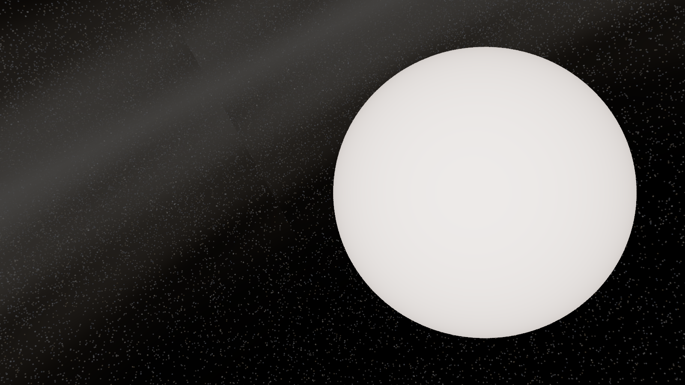

*The comparison inverted. Against a 10 M☉ hole the Sun is the giant: 9 000×
wider, and the black hole is smaller than one pixel. The program says so in its
report rather than quietly rescaling to make both visible.*

The program prints the numbers too:

```
  radius ratio         shadow / Sun  =  47.39
  volume ratio         shadow / Sun  =  1.064e+05
  apparent diameter    black hole 3.968 deg,  Sun 0.08064 deg
```

The comparison lands very differently depending on the hole:

| black hole | mass | shadow diameter | vs the Sun |
|---|---|---|---|
| stellar (X-ray binary) | 10 M☉ | 153 km | Sun is **9 000×** wider |
| Sagittarius A* | 4.3 × 10⁶ M☉ | 6.6 × 10⁷ km | shadow is **47×** wider |
| M87* | 6.5 × 10⁹ M☉ | 1.0 × 10¹¹ km | shadow is **72 000×** wider — 667 AU |
| TON 618 | 6.6 × 10¹⁰ M☉ | 1.0 × 10¹² km | shadow is **728 000×** wider — 6 770 AU, or 0.107 light-years |

For the stellar-mass case the hole is genuinely smaller than a pixel next to the
Sun, and the program says so rather than quietly cheating the scale.

---

## A quasar at the spin limit

"As fast as possible" has two different answers, and the gap between them is
the interesting physics.

The **mathematical** bound is $a = 1$. Past that the Kerr solution has no
horizon at all — a naked singularity — and cosmic censorship says nature should
not permit it.

But a black hole *fed by a radiating thin disc* cannot even reach that. Photons
emitted by the disc are preferentially swallowed when their angular momentum
opposes the spin, and that back-reaction balances the spin-up from accreted
matter at

$$a = 0.998$$

This is Thorne's limit (1974), and it means a maximally spinning astrophysical
black hole is a specific, calculable object rather than an arbitrary number
close to one.

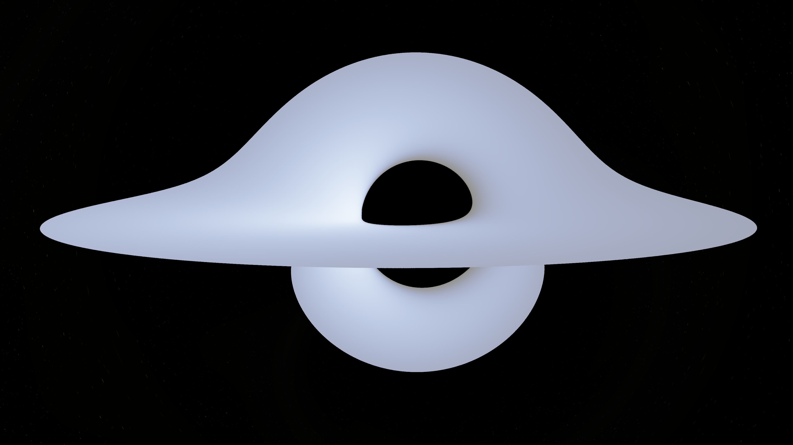

```bash
./blackhole --preset quasar
```

A billion solar masses at $a = 0.998$, accreting at half the Eddington rate:

```
  outer horizon r+     1.0632 M
  ISCO                 1.2370 M
  radiative efficiency 0.3210  (32.10% of mc^2; fusion manages 0.7%)
  luminosity           6.2855e+39 W  =  1.642e+13 L_sun  =  0.5 L_Edd

  Rotation
  horizon Omega_H      0.4693 c^3/GM   (a = 1 would give 0.5)
  horizon turns once   every 18.3 hours
  horizon circumference 9.865e+12 m  =  65.94 AU
  inner disc orbits    every 20.41 hours, at 12.21 AU
```

That is what "insanely fast" amounts to when you put numbers on it. The horizon
is **66 astronomical units around** — wider than Neptune's orbit — and it turns
once every **18.3 hours**. The inner edge of the disc, twelve AU out, completes
an orbit in under a day. Nothing about those figures is inserted; they follow
from $a$, $M$ and the Kerr metric.

The efficiency is the other consequence. At $a = 0.998$ the ISCO has come in to
1.24 GM/c², so matter falling from rest at infinity radiates **32% of its rest
mass** before it crosses the horizon. Hydrogen fusion manages 0.7%. Spun all the
way to $a = 1$ the figure would be $1 - 1/\sqrt3 = 42\%$.

### What the spin actually changes

| | |
|---|---|
|  | 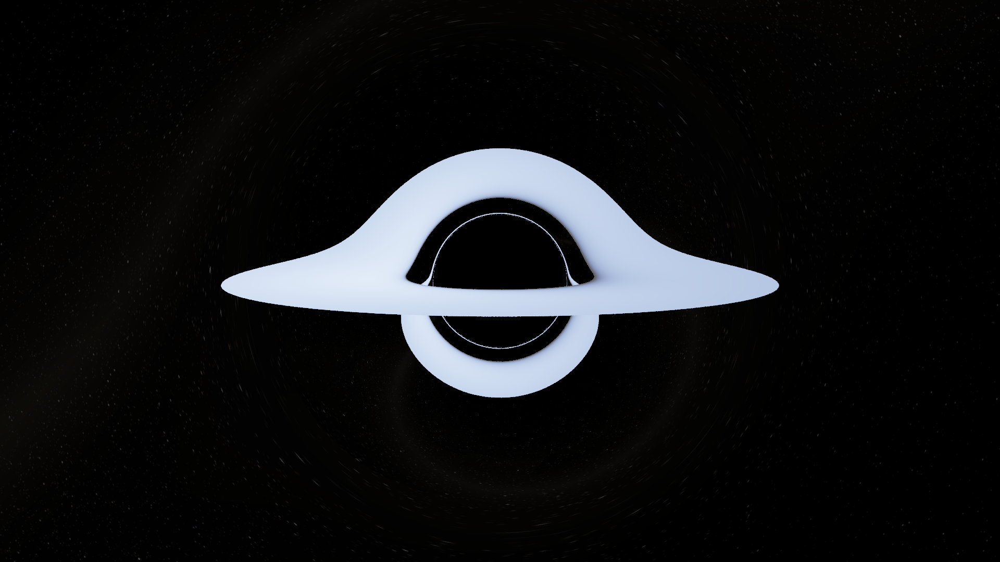 |
| **a = 0.998.** The disc reaches in to 1.24 GM/c², and frame dragging flattens one side of the shadow into the characteristic D. | **a = 0, the same hole otherwise.** The ISCO retreats to 6 GM/c², so there is a large empty gap inside the disc, the shadow is circular, and the efficiency drops from 32% to 5.7%. |

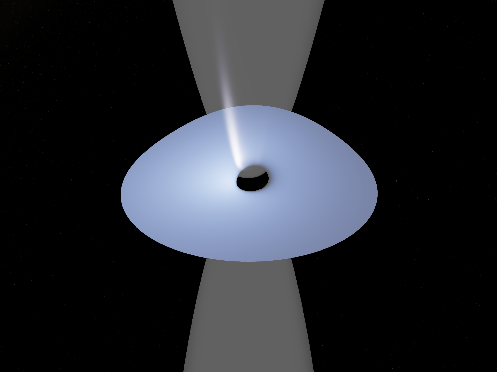

*The same quasar at 60° from the spin axis — closer to how a broad-line quasar
is actually oriented, since we have to be looking inside the opening of the
obscuring torus to see one at all. The frame above is more edge-on than that,
chosen because it is the geometry where spin shows.*

### The jets

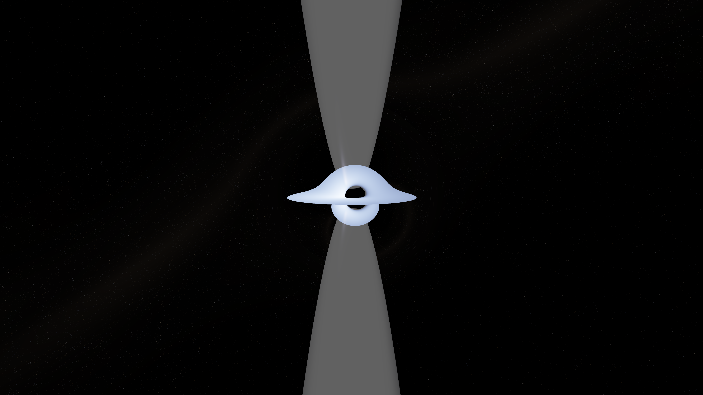

A quasar's jets are **not** powered by the accretion disc. They are powered by
the rotation of the hole itself.

Magnetic field lines threaded through the horizon by the accretion flow are
dragged round with it. A rotating horizon behaves like a resistive membrane, so
the twist propagates outwards as a Poynting flux, and the energy it carries comes
out of the hole's spin. Blandford and Znajek worked this out in 1977; the modern
form, calibrated against GRMHD simulations of the magnetically arrested state
(Tchekhovskoy, Narayan & McKinney 2011), is

$$\frac{P}{\dot M c^2} \;=\; \frac{\kappa}{4\pi}\,\phi^2\,\Omega_H^2\left(1 + 1.38\,\Omega_H^2 - 9.2\,\Omega_H^4\right)$$

with $\kappa = 0.053$ and $\phi \approx 50$ the saturated horizon flux. For the
`quasar` preset the program prints:

```
  Jets (Blandford-Znajek)
  horizon flux phi     50   (50 = magnetically arrested)
  jet power            3.9002e+40 W  =  1.019e+14 L_sun
  as a fraction of     Mdot c^2  x 1.9918   <- more than the accreted matter
                       brings in.  The surplus is the hole's own
                       rotational energy, so this jet spins it down
  disc luminosity      6.2855e+39 W   (jet / disc = 6.21)
  bulk Lorentz factor  2.34 at the base -> 10.00 asymptotically
  field-line rotation  Omega_F = 0.2347 c^3/GM  = Omega_H / 2
  light cylinder       4.26 GM/c^2
```

**The jet carries away twice the energy the accreting matter brings in.** That
is not a bookkeeping error. $\Omega_H^2$ is the whole story: set the spin to
zero and the power is exactly zero, because there is no rotational energy to
tap. `gallery/quasar-spin0.png` is that control image — same mass, same
accretion rate, no spin, and no jet anywhere in the frame.

#### Optically thin transfer

The disc stops a ray. A jet does not: it is optically thin, so its light is
*added* to whatever the ray finds behind it. Two Lorentz invariants,
$I_\nu/\nu^3$ and $j_\nu/\nu^2$, turn the transfer equation into

$$\frac{d}{d\lambda}\left(\frac{I_\nu}{\nu^3}\right) = \frac{j_\nu}{\nu^2}$$

and for a power-law synchrotron source $j_\nu = j_0(\nu/\nu_0)^{-\alpha}$, with
the affine parameter normalised so the camera measures unit photon energy, that
integrates to

$$I_\nu(\text{obs}) \;=\; \left(\frac{\nu_{\rm obs}}{\nu_0}\right)^{-\alpha}\int j_0\, g^{\,2+\alpha}\, d\lambda .$$

The ray tracer evaluates that integral with four-point Gauss–Legendre quadrature
on the dense-output polynomial of every accepted step, truncated wherever a
surface gets in the way — so the disc correctly eclipses the jet behind it.

Two things fall out. A shifted power law is the same power law, so the jet has
one fixed colour and only its brightness varies; $I_\lambda \propto
\lambda^{\alpha - 2}$ means that colour is blue, which is why M87's and 3C 273's
optical jets really are blue. And all of the relativistic physics sits in the
single scalar $g^{2+\alpha}$, where $g$ is computed from the traced null momentum
contracted with the plasma four-velocity — the same machinery that shades the
disc.

#### The one-sided jet is a result, not an input

| | |
|---|---|
| 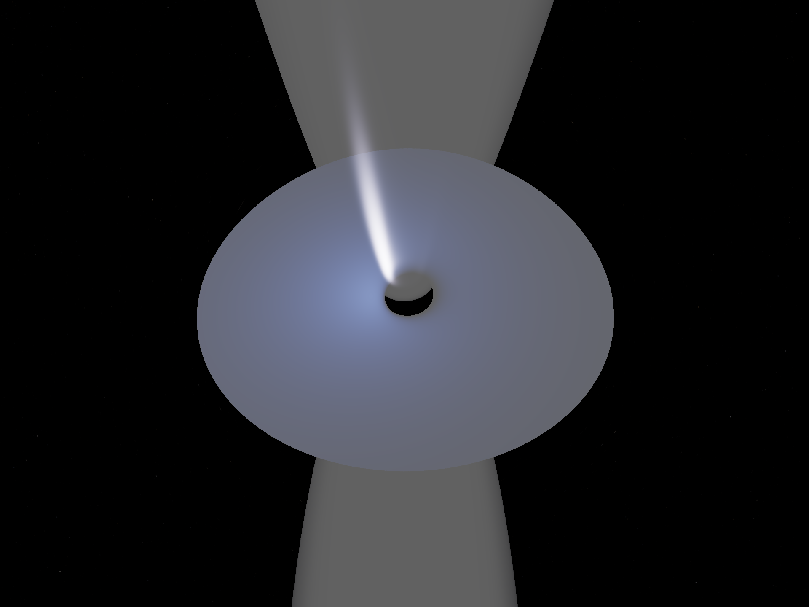 |  |
| **45° from the axis.** The upper jet is approaching and beamed towards us; the lower one is receding and beamed away. | **M87 at 17°**, the archetype and the object the collimation law here was measured on. Nearly pointed at us, so the counter-jet all but disappears. |

Nothing tells the renderer to draw one jet brighter than the other. Both are
identical in the plasma's own frame. The asymmetry is entirely
$\delta^{\,2+\alpha}$ with $\delta = 1/\Gamma(1-\beta\cos\theta)$, and the
validation suite checks that the renderer's $g$ reduces to exactly that formula
in the far field, to 7 × 10⁻¹⁶. At $\Gamma = 10$ the predicted jet /
counter-jet ratio is 9.5 × 10³ at 20° and only 1.8 at 84° — which is why a
quasar seen side-on shows two jets and a blazar shows one.

#### What is prescribed

A ray tracer cannot derive a jet's structure from the metric; that needs a GRMHD
simulation, which is a different program. So the geometry, velocity field and
emissivity profile are prescribed — but each from a measurement or a
conservation law, not from taste:

| quantity | value | where it comes from |
|---|---|---|
| collimation | $R \propto z^{0.58}$ | VLBI of M87 from 10 to 10⁵ $GM/c^2$ (Asada & Nakamura 2012). A *parabola*, not the cone a ballistic outflow would make |
| acceleration | $\Gamma \propto R$, saturating | magnetic acceleration theory (Komissarov et al. 2007), measured along M87 (Park et al. 2019) |
| emissivity | $j \propto \Gamma^{-(2+\alpha)}R^{-(3+\alpha)}$ | mass conservation $n\propto 1/\Gamma R^2$, flux freezing $B'\propto 1/\Gamma R$, and $j_\nu \propto n B'^{1+\alpha}$ |
| re-acceleration | $\times\, z^{\zeta}$, $\zeta = 2$ | the one fitted number. $\zeta = 0$ fades the jet by six orders of magnitude over the length drawn here, which is ruled out by jets staying visible to 10⁵ $GM/c^2$ |
| transverse profile | limb-brightened sheath | resolved in M87 (Kim et al. 2018) |
| field rotation | $\Omega_F = \Omega_H/2$ | the Blandford–Znajek solution itself |
| radiated fraction | 2% of $P$ | AGN jets are poor radiators; most of the power stays kinetic until the lobes |

The plasma four-velocity is built on the **ZAMO tetrad** rather than a static
frame, because the jet is launched from inside the ergosphere where no static
observer exists. It comes out normalised to $|u\cdot u + 1| < 3\times10^{-13}$
even at $r = 1.1\,GM/c^2$ with $a = 0.998$.

Not modelled: synchrotron self-absorption. The compact base of a real jet is
optically thick at low frequencies, which is what produces the "core shift"
seen in VLBI. Here the base is left transparent, so it renders as a very bright
unresolved core — which, as it happens, is what dominates almost every real VLBI
image of a jet anyway, but for a different reason.

### The inner disc, in motion


*Three orbits of a hot spot just outside the ISCO, over ten seconds. Each orbit
is about a day of real time. The spot is dragged round with the hole, brightens
sharply as it turns towards us, and its lensed second image runs round the far
side out of phase — the light that took the long way round arrives later.*

Five checks were added for this regime, all passing:

```
[PASS] ZAMO angular velocity tends to Omega_H at the horizon
       max relative difference = 2.89e-09; Omega_H(0.998) = 0.469332 c^3/GM
[PASS] no static observer can exist inside the ergosphere
[PASS] efficiency rises towards 1 - 1/sqrt(3) as a -> 1
       eta(0.998) = 0.3210, eta(0.9999) = 0.3820, extremal limit 0.4226
[PASS] ISCO, photon orbit and horizon converge as a -> 1
       a = 0.9999: ISCO 1.0785 M, photon orbit 1.0164 M, horizon 1.0141 M
[PASS] at the Thorne limit the ISCO is still outside the horizon
```

The ergosphere check is worth naming. Inside it $g_{tt}$ changes sign, so
"standing still" would require moving faster than light: *everything* in there
is dragged forwards no matter what it does. The horizon's own angular velocity
$\Omega_H = a/2r_+$ is not a separate definition either — it is the limit of the
zero-angular-momentum observer's $\omega = 2ar/A$ as $r \to r_+$, and the two
agree to 3 × 10⁻⁹.

---

## Neutron stars

A neutron star is a *body*, not a hole, and that changes the physics entirely.
It has an interior, and the interior is what sets everything else.

### Structure: the TOV equation

Einstein's field equations, for a static sphere of perfect fluid, reduce to the
Tolman–Oppenheimer–Volkoff equation:

$$\frac{dP}{dr} = -\,\frac{G\left(\rho + P/c^2\right)\left(m + 4\pi r^3 P/c^2\right)}{r^2\left(1 - 2Gm/rc^2\right)}, \qquad \frac{dm}{dr} = 4\pi r^2\rho$$

Every departure from Newtonian hydrostatics is visible in that first equation:
**pressure itself gravitates** (the $P/c^2$ terms), and the denominator runs
away as the star approaches its own Schwarzschild radius. Both push the same
way — towards collapse. That is why a relativistic star has a *maximum mass* at
all, and why no equation of state can escape one.

Nothing about a star's size is typed in here. You choose an equation of state
and a mass; the radius is whatever hydrostatic equilibrium gives:

```bash
./blackhole --neutron-star --eos sly --ns-mass 1.4
./blackhole --eos sly --mass-radius        # the whole mass-radius curve
```

```
  central density      9.4726e+17 kg/m^3  =  3.51 x nuclear saturation
  gravitational mass   1.4000 Msun
  baryon mass          1.6268 Msun
  binding energy       4.0533e+46 J  =  0.2268 Msun c^2  (released when it formed)
  radius               11.1399 km   =  5.3885 GM/c^2
  compactness r_s/R    0.3712     (Buchdahl's bound is 0.8889)
  surface redshift z   0.2610
  surface gravity      1.8881e+12 m/s^2  =  1.925e+11 g
  max sound speed      0.6255 c   (causality needs < 1)
  visible surface      79.5% of the total area, from light bending alone
```

That binding energy is worth pausing on: it is not an input. The star's baryons
weigh 1.63 M☉ but the star gravitates as 1.40, and the missing 0.23 M☉c² —
4 × 10⁴⁶ J — is what a supernova sheds in neutrinos. SN 1987A radiated about
3 × 10⁴⁶ J.

Four equations of state are available, three of them derived from first
principles so they can be *checked* rather than trusted:

| | validated against |
|---|---|
| ideal degenerate neutron gas | the 1939 Oppenheimer–Volkoff limit, **0.7101 M☉** |
| ideal degenerate electron gas | the Chandrasekhar limit, **1.4253 M☉** |
| polytrope | the analytic Lane–Emden radius, to 2.6 × 10⁻⁴ |
| uniform density | the exact interior Schwarzschild solution of 1916 |
| SLy / MS1 piecewise polytropes | the masses and radii pulsar timing and NICER measure |

The free neutron gas result is the historically important one. With no nuclear
forces at all, degenerate neutrons top out at 0.71 M☉ — well under the 2.08 M☉
of PSR J0740+6620. That gap *is* the argument that the strong interaction has
to be doing most of the work, and it is why the equation of state above nuclear
density is still an open problem.

### Optics: seeing round the back

By Birkhoff's theorem the exterior of a static spherical star is *exactly*
Schwarzschild, so the same metric and integrator that draw the black holes
apply unchanged with $a = 0$.

But the picture is different. There is no horizon, no shadow, and — because the
surface at 5.4 GM/c² sits outside the photon sphere at 3 GM/c² — no photon ring
either. What there is instead is enough light bending that a large slice of the
**far** hemisphere is visible: 79% of the total surface area at once, not 50%.

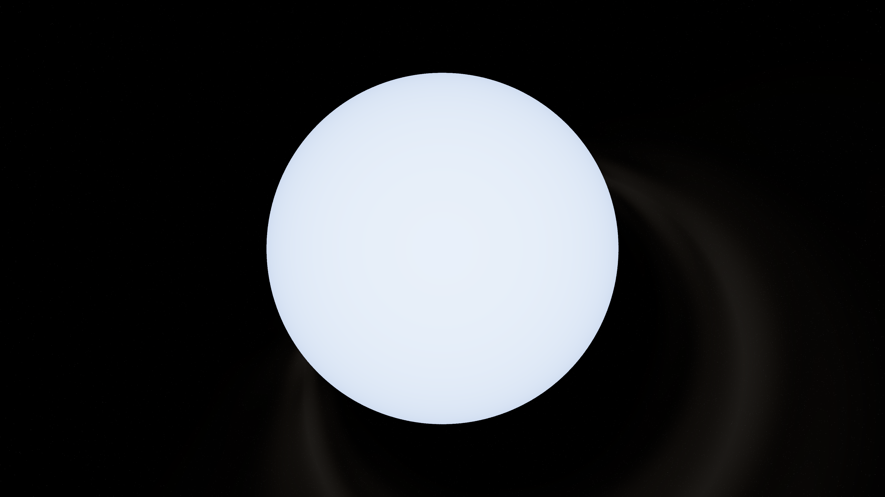

Rotation is handled the way NICER's pulse-profile modelling does, in its
Schwarzschild + Doppler form: the metric stays Schwarzschild while the surface
moves rigidly, which gives the Doppler shift, aberration and beaming of a
rotating surface. What that leaves out is frame dragging and the mass
quadrupole of a genuinely rotating star — **Kerr is not the exterior of a
rotating neutron star**, because its quadrupole moment is not the one a real
star has. The approximation is good to a few percent below a few hundred hertz
and degrades for the fastest millisecond pulsars.

Magnetic polar caps are carried round with the star, sampled at the retarded
time so they appear where they *were* when the light left:

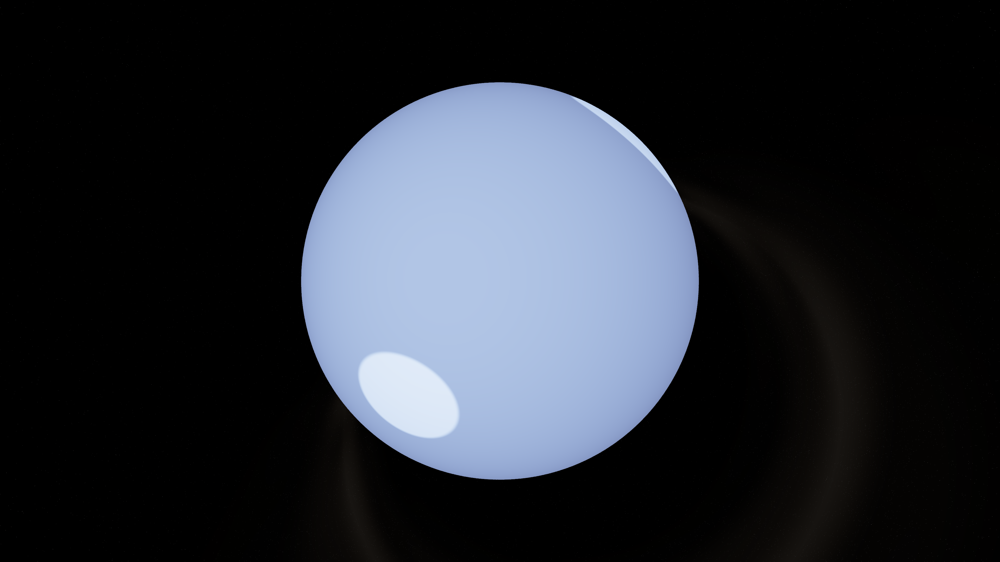

```bash
./blackhole --neutron-star --ns-spin 400 --caps --cap-tilt 60 --inclination 70
```

*One cap faces us at the lower left. The bright sliver on the upper-right limb
is the **other** cap — on the far side of the star, bent into view. That effect
is what makes NICER's radius measurements possible: how much of the back you
can see depends on the compactness, so the shape of the pulse constrains
$M/R$.*

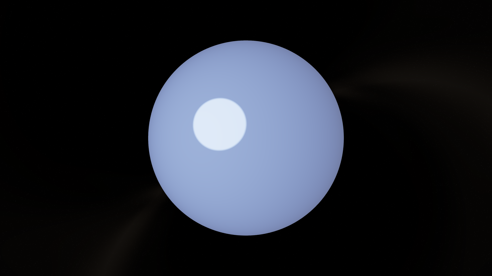

*700 Hz, seen almost edge-on. The equator is moving at 0.18 c, so the
approaching limb is Doppler-boosted and the receding one dimmed — the same
beaming that skews the accretion disc of a black hole, on a solid surface.*

| | |
|---|---|
| 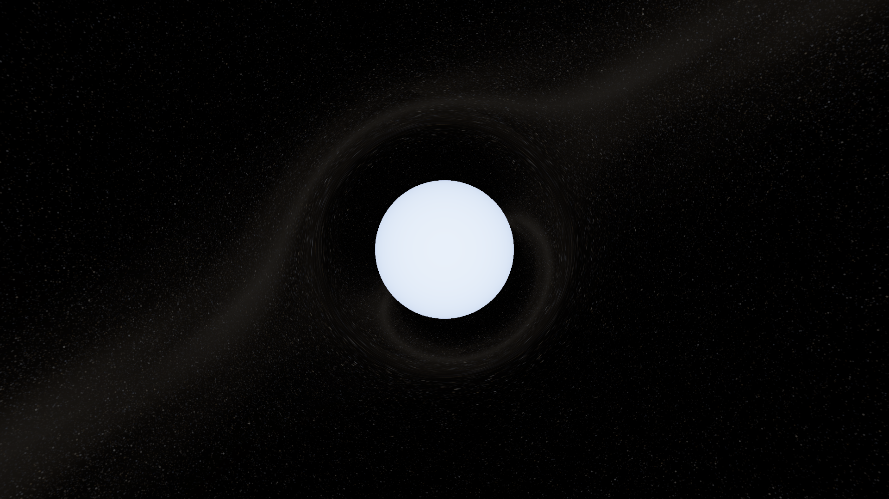 | 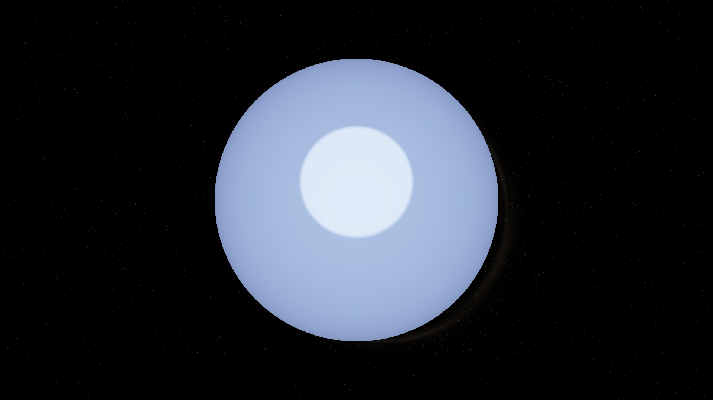 |
| **From 25 GM/c².** The star is small in frame, but the sky behind it is wound into concentric arcs — the Milky Way, lensed. | **Nearly pole-on**, with a small magnetic obliquity. Both caps stay in view all the way round, so this geometry barely pulses at all. |
| 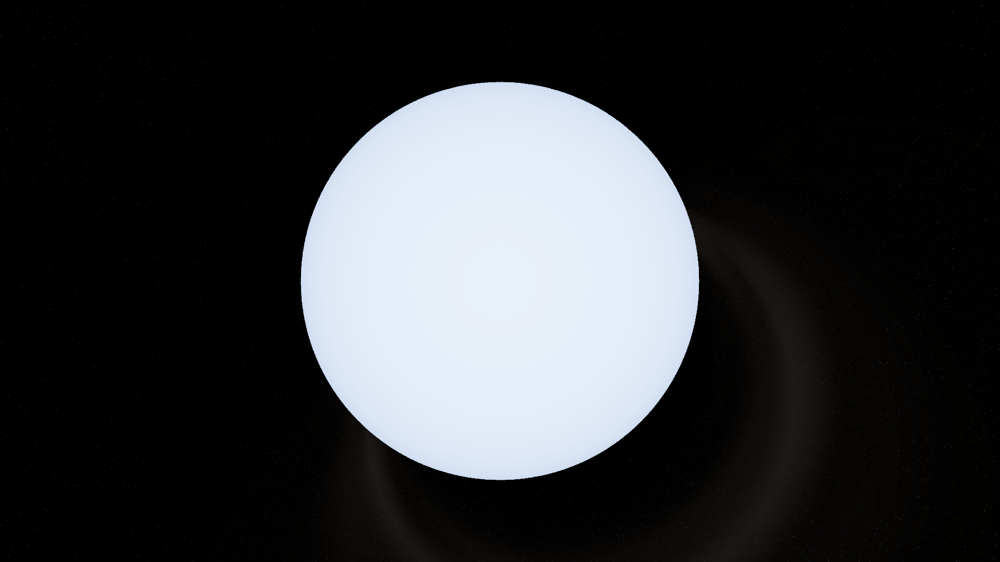 | 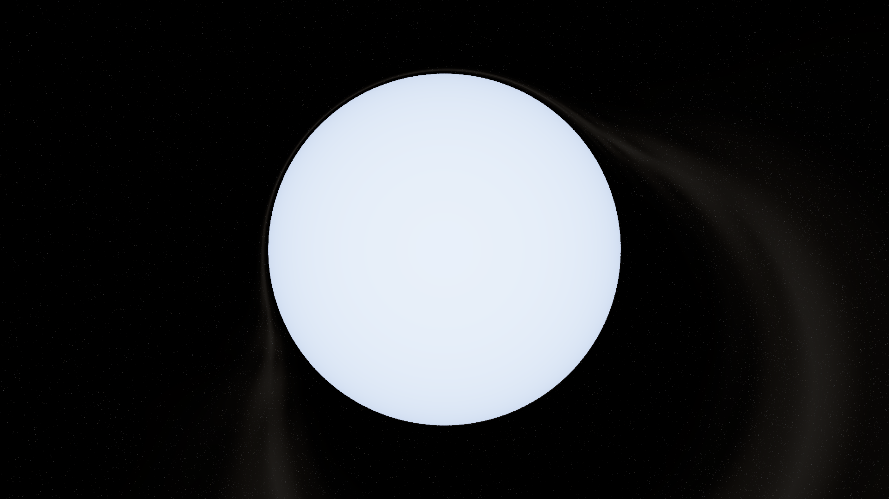 |
| **The same 1.4 M☉ with a stiff equation of state (MS1)**: 13.9 km instead of 11.1, and visibly less lensed, because a bigger star is a less compact one. | **2.05 M☉ on SLy**, near the top of what that equation of state can hold: more compact, more strongly lensed, redshift 0.35. |

---

## The night sky

Every render now has a real background: 500 000 stars from the observed
magnitude distribution, plus the Milky Way at its true surface brightness,
lensed by whatever is in the foreground.

Making that visible needed a display change, because the contrast is brutal.
Measured on an actual frame, a neutron star's surface outshines the brightest
background star in shot by **1.3 × 10⁻¹⁶** — sixteen orders of magnitude. A
filmic curve puts the sky below black; a pure logarithmic curve spanning
sixteen decades gives the subject only 7% of the tonal range and returns it as
featureless white.

The default `hdr` curve keeps the ACES response where the subject is and blends
a logarithmic floor in underneath, so both survive:

$$\text{out} = f + 0.35\,L\,(1-f), \qquad f = \mathrm{ACES}(x),\; L = \frac{\log_{10}(1+kx)}{\log_{10}(1+k)}$$

It is a display transform and nothing else — the radiance behind it is
untouched, and `--tonemap aces` gives the old look back. Veiling glare now
defaults to **off** for the same reason: it is a camera model, and with the sky
visible it greys the background and softens the shadow rather than flattering
them.

---

## Video

There is a constraint here worth stating before the how-to, because it decides
the whole design: **a Novikov–Thorne disc is stationary and axisymmetric.**
Nothing about it depends on `t` or on `φ`. So orbiting the camera in azimuth,
or "spinning the disc", produces 240 pixel-identical frames. Something has to
genuinely break the symmetry.

Two things can:

**An orbiting hot spot** (`--hotspot R`) — a compact brightness enhancement
carried around on a circular Keplerian geodesic. This is not invented for the
demo: GRAVITY has watched exactly this near Sgr A*, flares tracing loops on the
sky with 30–70 minute periods.


The timing is the interesting part. Each ray already carries the coordinate time
it took to arrive (negative — it is traced into the past), so the emission time
is just `t_emit = t_observer + y[Y_T]`, and the spot is placed where it *was*
then. Light bending means a photon that loops around the hole arrives much later
than one that came straight, so the secondary image shows the spot at an earlier
orbital phase than the primary. That echo falls straight out of integrating `t`
alongside everything else. At the default camera distance the light crossing time
is comparable to the orbital period, so the lag is a visible fraction of a cycle.

**Moving the camera in `θ` or `r`** — the two directions that are not symmetry
directions:


With jets in the frame, the same camera move shows something else. The jets are
*identical* in their own rest frame at every instant of this film — nothing
about the source changes. What changes is the angle between the flow and the
line of sight, and with it the Doppler factor
$\delta = 1/\Gamma(1-\beta\cos\theta)$ raised to the power $2+\alpha$:


*From 8° to 90°. Near the axis the approaching jet is beamed hard towards us
and the receding one has all but vanished; by edge-on the two are equal again
and both are dimmer than the approaching jet ever was. That asymmetry is the
standard way jet speeds are measured in real sources.*

```bash
# 10 seconds, 24 fps, two orbits of a hot spot — self-contained animated PNG
./blackhole --preset sgra --inclination 60 --fov 34 \
    --hotspot 9 --hotspot-size 1.1 --hotspot-contrast 200 \
    --orbits 2 --duration 10 --fps 24 \
    --width 400 --height 300 --spp 1 --no-stars \
    --out video/hotspot-orbit.apng

# face-on to edge-on
./blackhole --preset sgra --inclination 4 --inclination-to 89 --fov 34 \
    --duration 10 --fps 24 --width 480 --height 300 --spp 1 --no-stars \
    --out video/inclination-sweep.apng

# Doppler beaming switching off, as the jets swing side-on
./blackhole --preset quasar --inclination 8 --inclination-to 90 --fov 62 \
    --duration 10 --fps 15 --width 420 --height 315 --spp 1 \
    --out video/quasar-jet-sweep.apng
```

`.apng` writes a self-contained animated PNG that plays in any browser, using
the same DEFLATE encoder as the stills — no ffmpeg needed. **Any other
extension writes a numbered PNG sequence** and prints the ffmpeg command for an
mp4:

```bash
./blackhole --preset sgra --hotspot 9 --duration 10 --fps 24 \
    --width 1280 --height 720 --spp 2 --out frames/f_%04d.png
ffmpeg -framerate 24 -i frames/f_%04d.png -c:v libx264 -pix_fmt yuv420p -crf 18 out.mp4
```

The program reports what the film means physically:

```
  Hot spot
  orbital radius       9.00 M   (ISCO is at 2.32 M)
  orbital period       178.7 GM/c^3  =  63.1 minutes
  orbital speed        0.3333 c (as measured by a local static observer)
  sequence covers      2 orbits  =  7.5678e+03 s of real time
  played over          10.00 s at 24 fps  ->  757 x faster than real time
```

That period scales with mass exactly as it should: 63 minutes for Sgr A\*,
55 days for M87\*, 7.3 milliseconds for a 10 M☉ hole.

Two details that matter for animation. **Exposure is metered once and locked**
for the whole sequence — metering per frame would make the film flicker, and
worse, would suppress the very brightness variation the hot spot is there to
show. And a pure hot-spot sequence divides the phase by the frame count rather
than by count − 1, so the last frame does not duplicate the first and the loop
is seamless; a camera sweep is not periodic and does reach its endpoint exactly.

Cost is the obvious catch: a 10-second film is 150–240 renders, roughly 15
minutes on four cores. Keep `--spp 1` and a small `--width` while you find the
shot.

On file size: APNG is a still-image format pressed into service, so the encoder
works to keep it honest. Each frame stores **only the rectangle that changed**
(`fcTL` sub-frames with `dispose_op = NONE`, `blend_op = SOURCE`) — for the hot
spot, where a small bright blob moves across a static disc, that is about 7% of
the canvas per frame. And the DEFLATE stage builds **dynamic Huffman codes**
from the actual symbol statistics rather than using the fixed tables, which
lands within a few percent of `zlib -9`. Together those took the two films from
8 MB and 12 MB down to 1.8 MB and 4.4 MB, with no loss — every composited frame
is still byte-identical to the corresponding standalone render.

That is about as far as a lossless intraframe format goes. For anything
size-critical, write a PNG sequence and let ffmpeg apply a real video codec;
H.264 will beat this by another order of magnitude.

One check worth mentioning, because it validates the whole time pipeline at
once: the hot-spot film covers exactly two orbits in 240 frames, so the period
is exactly 120 frames — and frames 0 and 120 come out **byte-identical**, as do
30 and 150. Frame 239 differs from frame 0 by about as much as frame 1 does, so
the loop is seamless with no duplicated frame.

---

## Verification

`./blackhole --test` runs 40 checks. It is the point of the project as much as
the pictures are.

### Einstein's equations, checked numerically

The Ricci tensor is assembled from the metric components alone — fourth-order
finite differences into Christoffel symbols, then into the Riemann tensor — with
no analytic shortcut. For a vacuum solution it must vanish:

```
[PASS] Kerr satisfies R_{mu nu} = 0 (numerically, from g)
       max |R_mn| / (curvature scale) = 3.75e-09
[PASS] Riemann tensor reproduces the analytic Kretschmann scalar
       max relative error = 6.22e-09
[PASS] curvature is finite at the event horizon    K(r=2M) = 0.750000 = 48/64
```

That last one is the statement that the horizon is not a singularity — the
Kretschmann scalar $K = R_{abcd}R^{abcd}$ is perfectly finite there, and the
apparent blow-up of $g_{rr}$ is an artefact of the coordinates.

### Mercury

A timelike geodesic of the real Sun's Schwarzschild field, with Mercury's real
orbital elements, integrated for one radial period:

```
[PASS] Mercury's anomalous perihelion advance
       integrated 42.971"/century  (GR formula 42.982", observed 42.98 +/- 0.04")
```

### Light bending

The traced geodesic is compared against an exact one-dimensional quadrature of
$d\phi/du = (b^{-2} - u^2 + 2Mu^3)^{-1/2}$, and that quadrature is separately
checked against Einstein's $4GM/c^2b$:

```
[PASS] traced geodesic matches the exact deflection integral
       b = 20 M: traced 3.377328649 rad, exact quadrature 3.377328649 rad
[PASS] light deflection tends to 4GM/(c^2 b)
       b = 1e+04 M: exact 4.0011788949e-04 rad, 4M/b = 4.0000000000e-04
[PASS] shadow radius is the critical impact parameter 3 sqrt(3) M
       b_crit = 5.19615242 M vs 3 sqrt(3) = 5.19615242 M
```

### Everything else

| what | result |
|---|---|
| $g^{\mu\nu}g_{\nu\lambda} = \delta^\mu_\lambda$ | 5.6e-16 |
| photons stay null along the ray | 3.0e-11 |
| Carter's constant conserved | 8.7e-11 |
| energy $E = -p_t$ conserved | **exactly zero drift** |
| ISCO: 6M (a=0), 1M/9M (extremal) | exact |
| photon sphere: 3M (a=0), 1M/4M (extremal) | exact |
| ZAMO has $u_\phi = 0$ | 1.1e-16 |
| Page–Thorne closed form vs direct quadrature | 1.5e-12 |
| disc luminosity $= \eta\dot Mc^2$ | agrees to 6 significant figures |
| $\int B_\lambda\,d\lambda = \sigma T^4/\pi$ | 3.2e-11 |
| Wien's displacement law | 2.5e-05 |
| Doppler factor → $1/\gamma(1\mp v)$ far out | 3.2e-05 |
| jet plasma four-velocity normalised, inside the ergosphere | 2.8e-13 |
| jet redshift factor → $1/\Gamma(1-\beta\cos\theta)$ far out | 7.2e-16 |
| Blandford–Znajek power $\propto \Omega_H^2$ at small spin | 1.8e-04 |
| jet emitted power vs the Blandford–Znajek budget | exact to 6 figures |
| Sgr A* shadow vs EHT (51.8 ± 2.3 µas) | predicts 53.3 µas |
| M87* shadow vs EHT (42 ± 3 µas) | predicts 39.7 µas |

Every render also reports its own accuracy:

```
  worst |g^ab p_a p_b|  2.25e-09   (photons should stay exactly null)
  worst drift in Q      5.74e-07   (Carter's constant)
```

---

## Gallery

All rendered by the code in this repository. The flagship frames are
**3840 × 2160**; the comparison strips stay at 1280 × 720 because they are shown
as thumbnails, and the two star-field frames stay at 1920 × 1080 because a sky
full of isolated bright pixels is high-entropy and quadruples in file size
without looking meaningfully better.

A note on sampling: 4K at `--spp 2` places samples *closer together* than
1080p at `--spp 3` — fov/7680 against fov/5760 — so these are better sampled as
well as larger, at about half the cost of 4K with 9 samples.

### The four real black holes, to the same recipe

| | |
|---|---|
| 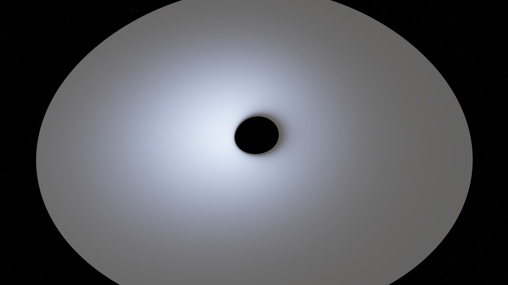 |  |
| **TON 618** — 6.6 × 10¹⁰ M☉, the largest here by far. Its shadow is **0.107 light-years** across: 6 770 AU, or 113 times the width of Neptune's orbit. At 45° from the spin axis, about the most edge-on view still consistent with seeing it as a broad-line quasar at all. | **M87\***, 17° from the spin axis. Nearly face-on, so the Doppler asymmetry is weak and the ring is almost round, and the jet — the first one ever discovered, in 1918 — points close enough to us that its approaching side is beamed bright and the counter-jet nearly vanishes. The orange is a computed colour, not a palette: a few-thousand-kelvin disc. |
|  |  |
| **Sagittarius A\***, 8° from edge-on. The left side is brighter because it is approaching — at the inner disc the beaming contrast is about 8:1. | **Stellar-mass X-ray binary**, 10 M☉ at 0.1 Eddington. The disc peaks at 7 × 10⁶ K, so its output is X-ray and only the blue Rayleigh–Jeans tail is visible. |

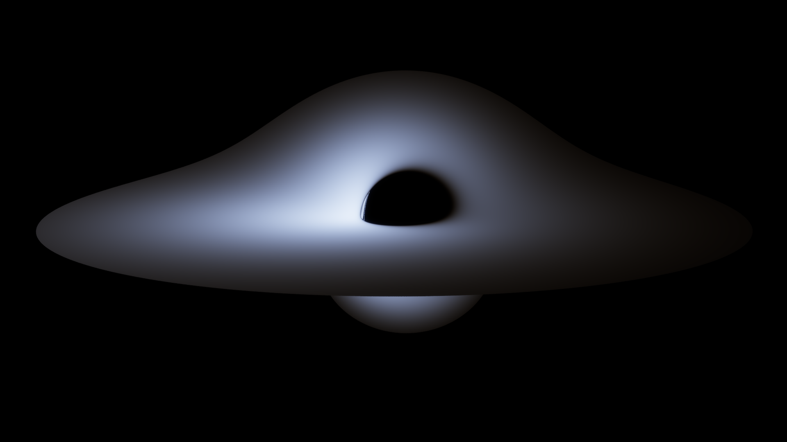

*TON 618 seen 10° from edge-on. This is **not** our actual line of sight — at
this inclination the obscuring torus would hide the broad lines that identify it
as a quasar — but it is the angle at which the lensing shows itself: the band
arcing over the shadow is the far side of the disc, bent up and over the hole.*

### One hole, three viewing angles

| | | |
|---|---|---|
| 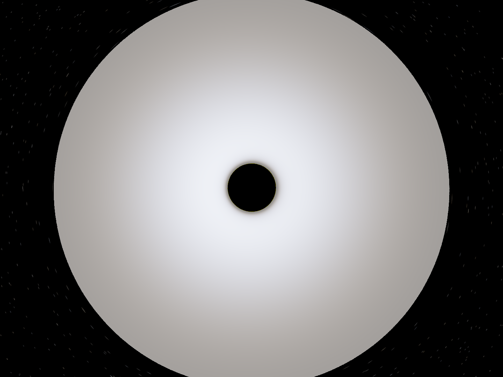 | 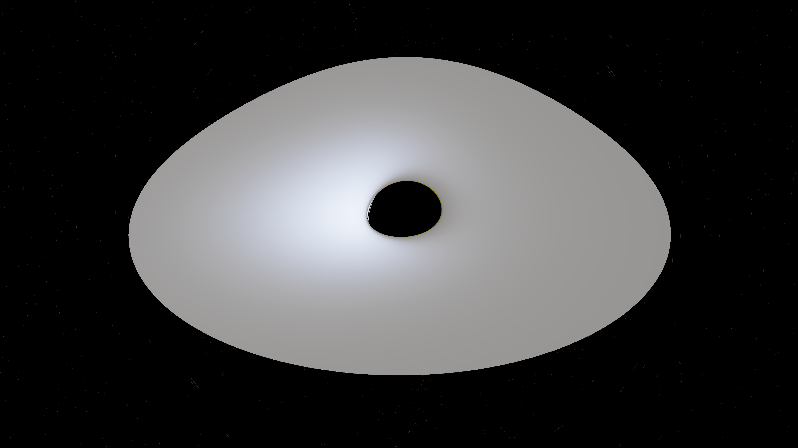 | 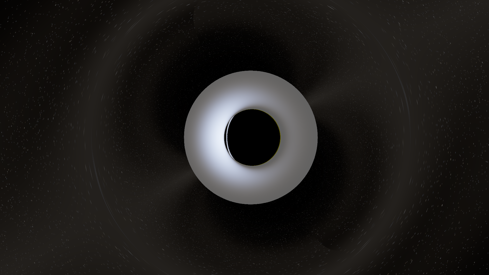 |
| **5°** — down the spin axis. A flat ring; no beaming asymmetry, because nothing is moving towards us. | **60°** — the disc tips, the far side starts to lift over the shadow, and the approaching limb brightens. | **90°** — exactly edge-on. The disc itself is a razor line; everything above and below it is lensed light from its far side. |

### Spin

The same hole and disc at four values of *a/M*. Watch the inner edge: the ISCO
moves from 6M to 1.24M, so the disc reaches further in and gets hotter, and the
shadow becomes visibly non-circular as frame dragging drags one side of the
photon ring inward.

| | | | |
|---|---|---|---|
| 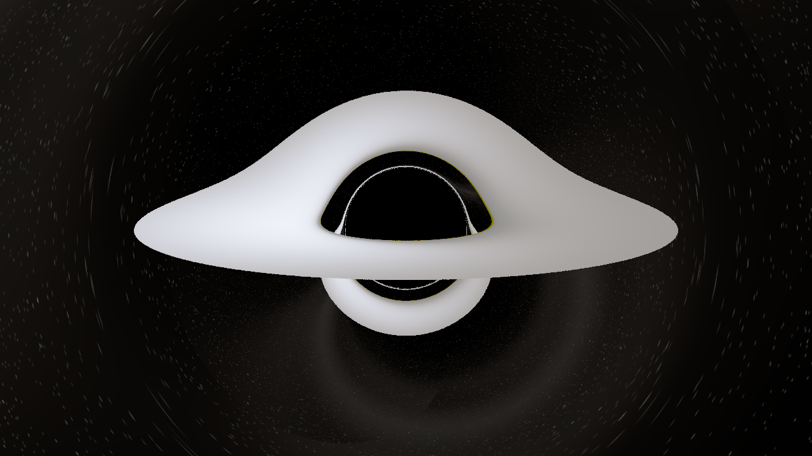 | 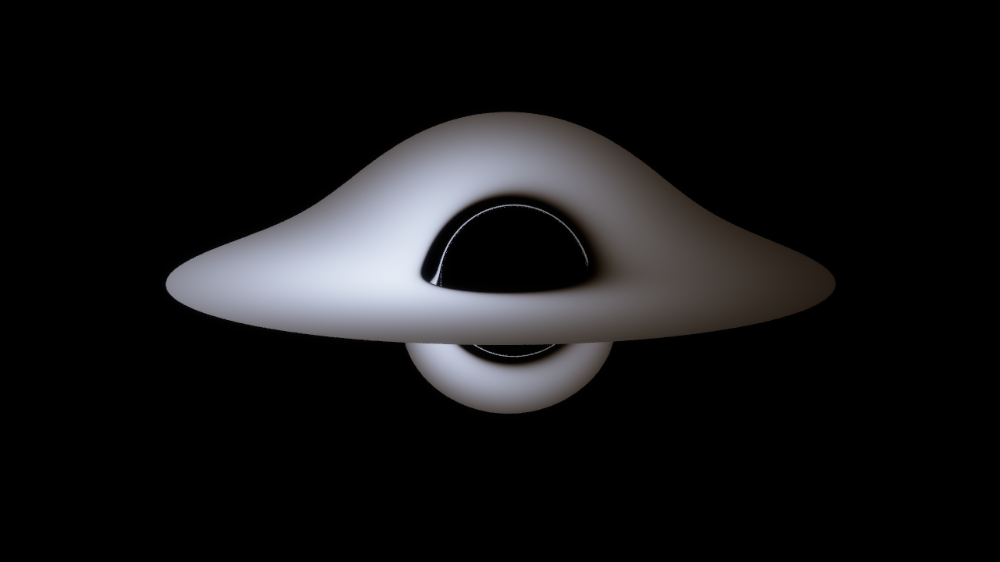 | 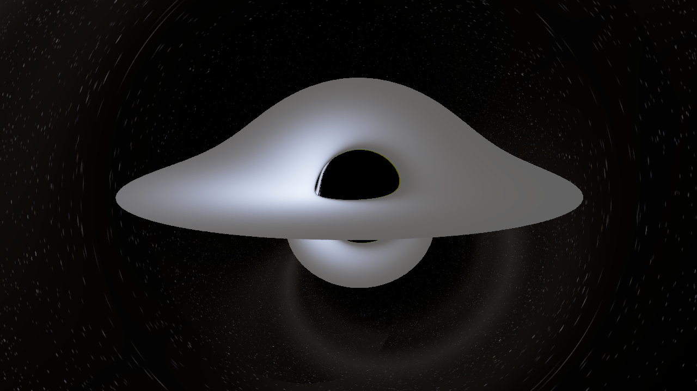 | 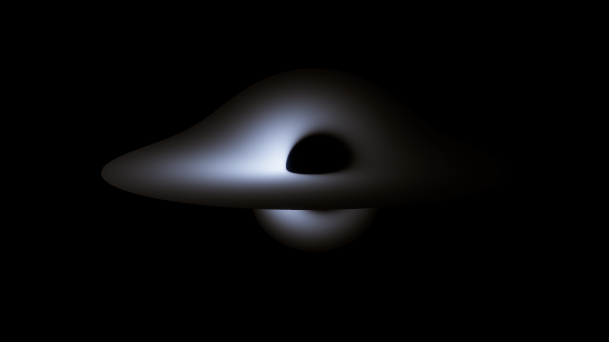 |
| **a = 0** — Schwarzschild. ISCO 6M, efficiency 5.7%. | **a = 0.5** — ISCO 4.23M, efficiency 8.2%. | **a = 0.9** — ISCO 2.32M, efficiency 15.6%. | **a = 0.998** — the Thorne limit. ISCO 1.24M, efficiency 32%. |

### Two more things the physics does on its own

| | |
|---|---|
| 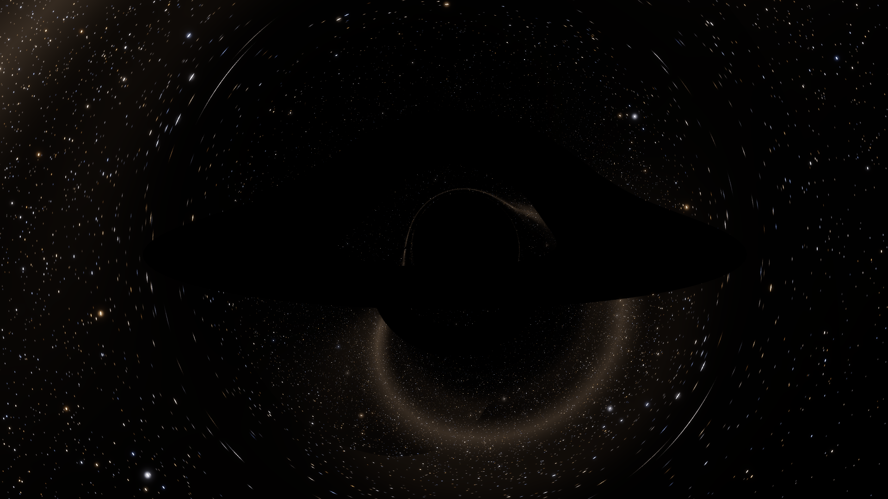 | 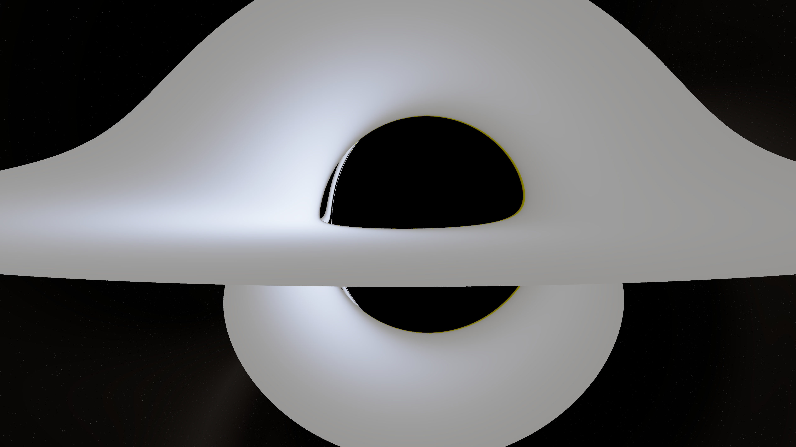 |
| **A retrograde disc**, orbiting against the hole's spin. The ISCO retreats to 8.7M, so the inner disc is cooler and dimmer, and the beaming asymmetry flips to the other side. | **Close in on the photon ring**, at 4K. The thin bright sliver pressed against the shadow's edge — above and below — is light that looped around the hole before escaping: the disc's inner rim, imaged again at higher order. |

### Lensing of the background sky


*No disc: just 500 000 stars and the Milky Way, seen through the hole's gravity.
The Einstein ring, the secondary images inside it, and the shadow's D-shaped
flattening from frame dragging are all consequences of the traced geodesics.*

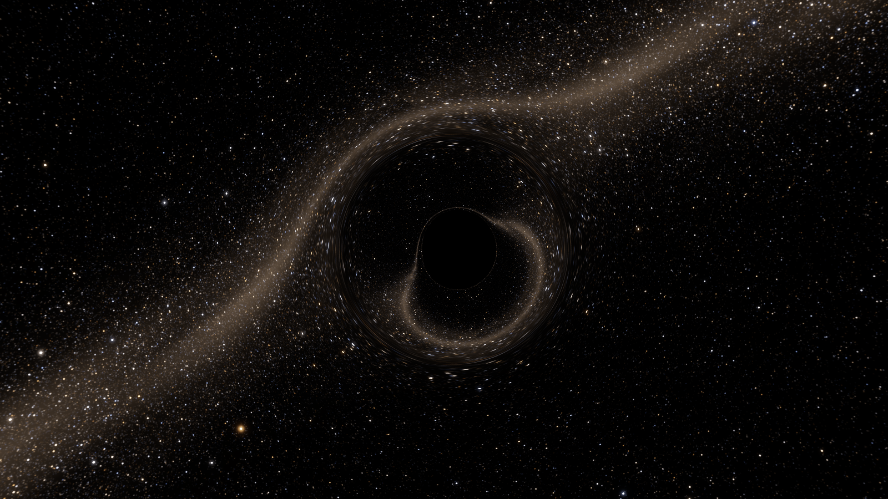

*From 40 GM/c² with a 110° field of view. This close, the hole lenses a large
fraction of the whole sky into the ring around it — including the part of the
sky directly behind the camera.*

---


## Usage

```
SCENE
  --preset NAME        sgra | m87 | ton618 | quasar | stellar | gargantua | custom
  --mass MSUN          black hole mass in solar masses
  --spin A             dimensionless spin a/M in [-0.9999, 0.9999]
  --distance R         camera distance in gravitational radii GM/c^2
  --inclination DEG    viewing angle from the spin axis (90 = edge on)
  --fov DEG            horizontal field of view

DISC
  --no-disc            switch the accretion disc off
  --disc-outer R       outer radius in gravitational radii
  --eddington F        accretion rate as a fraction of the Eddington rate
  --retrograde         disc counter-rotates with respect to the hole

JETS
  --jets               add Blandford-Znajek plasma jets along the spin axis
  --no-jets            switch them off (they are on for quasar and m87)
  --jet-length Z       how far the jets are drawn, in GM/c^2 (default 130)
  --jet-gamma G        terminal bulk Lorentz factor (default 10)
  --jet-alpha A        synchrotron spectral index, S_nu ~ nu^-A (default 0.7)
  --jet-efficiency F   fraction of the jet power that is radiated (default 0.02)
  --jet-flux PHI       dimensionless magnetic flux on the horizon (default 50)

THE SUN
  --sun                add the Sun at the same distance as the black hole
  --sun-distance R     place the Sun this far from the hole instead

SKY
  --no-stars           empty background instead of a lensed star field
  --stars N            number of stars (default 250000)
  --seed N             random seed for the star field

IMAGE
  --width N  --height N
  --spp N              samples per pixel is N*N (default 2)
  --exposure X         exposure multiplier; omit for automatic
  --tonemap NAME       aces | reinhard | log | linear
  --glare X            veiling-glare strength in [0,1]
  --log-decades N      decades of radiance the "log" curve spans
  --out FILE           .png / .ppm, or .apng for a self-contained animation

ANIMATION
  --duration S         make a film S seconds long (with --fps sets the count)
  --frames N           or give the frame count directly
  --fps N              frames per second (default 24)
  --hotspot R          orbiting hot spot at radius R - the thing that moves
  --hotspot-contrast X peak brightness over the quiescent disc
  --hotspot-size S     Gaussian radius in GM/c^2
  --orbits N           hot-spot orbits covered by the sequence
  --inclination-to D   sweep the viewing angle to D degrees
  --distance-to R      sweep the camera distance to R
  --fov-to D           sweep the field of view to D degrees

  --out FILE           output file (.png or .ppm)

OTHER
  --threads N          worker threads (default: all cores)
  --test               run the physics validation suite and exit
```

Some things worth trying:

```bash
# retrograde disc: the ISCO moves out to 8.7M and the beaming flips sides
./blackhole --preset sgra --retrograde

# nearly extremal, nearly edge-on
./blackhole --spin 0.998 --inclination 89 --preset gargantua

# no disc, wide field: pure lensing of the star field
./blackhole --no-disc --fov 60 --stars 500000

# look down the spin axis
./blackhole --preset sgra --inclination 5

# TON 618, one of the most massive black holes known
./blackhole --preset ton618

# the full length of the jets, from further back
./blackhole --preset quasar --distance 150 --fov 75 --jet-length 220

# the same hole with the spin turned off - and therefore no jet at all
./blackhole --preset quasar --spin 0
```

A note on `--glare`: it is a camera model, a convolution with a heavy-tailed
point spread function. Any such kernel is finite, and under a very wide display
stretch (`--tonemap log` with many decades) the edge of the kernel becomes
visible as a halo boundary around saturated sources. Use `--glare 0` for
wide-latitude renders.

Output is PNG, written by a self-contained encoder (CRC-32, Adler-32, and a
small DEFLATE with LZ77 and fixed Huffman codes) so there is no zlib or libpng
dependency. `.ppm` also works.

---

## Building

```bash
make            # or: cmake -B build && cmake --build build
make test       # the 40 physics checks
make images     # regenerate gallery/ (20 stills, ~90 min)
make videos     # regenerate video/  (2 films, ~30 min)
```

Needs a C++17 compiler and pthreads. Nothing else. `-ffast-math` is
deliberately *not* used: the conservation checks depend on IEEE semantics, and
reassociating the geodesic right-hand side would quietly cost accuracy.

Cost is roughly 170 integration steps per ray. A 1200 × 675 frame at 9 samples
per pixel is about 7 × 10⁶ rays and takes a few minutes on four cores.

---

## What is modelled, and what is not

Honest list, because "real physics" should come with its boundaries.

**Modelled exactly.** The Kerr geometry; null and timelike geodesics; the event
horizon, ergosphere, photon sphere and ISCO; frame dragging; gravitational
lensing to arbitrary order, including higher-order images; gravitational
redshift; special-relativistic Doppler shift and beaming of orbiting matter;
Novikov–Thorne disc structure and its emitted flux; Planck emission with the CIE
colorimetry; solar limb darkening.

**Modelled approximately.**
- The disc is *stationary, axisymmetric and geometrically thin*. Real discs are
  turbulent, have finite scale height, and vary on the orbital timescale.
- Emission is *thermal blackbody* from the disc surface. For Sgr A* and M87\* the
  real emission is optically thin synchrotron from a hot, radiatively
  inefficient accretion flow, which is a different beast; the presets use a thin
  disc regardless, so the M87\* image here should be read as "what a thin disc
  would look like at that mass and inclination", not as a reproduction of the
  EHT observation. The *shadow size* is a pure geometry result and does match.
- Limb darkening is grey (wavelength-independent).
- The plunging region inside the ISCO is treated as transparent.
- The jets' *power* and *beaming* are computed; their geometry, velocity field
  and emissivity profile are prescribed from measurements and conservation
  laws. One parameter — the re-acceleration index — is fitted rather than
  derived.

**Not modelled.** Radiative transfer through the disc or any intervening
medium — the spacetime is vacuum, so rays travel unabsorbed and unscattered
until they hit something. No corona, no self-gravity of the disc, no MHD: the
jets are transported exactly but their structure is prescribed (see
[The jets](#the-jets)), and there is no synchrotron self-absorption, so the jet
base is transparent where a real one would be opaque. The Sun's own mass does not curve
spacetime here; light passing its limb would be deflected by 1.75″, which is
negligible at every scale in these images. No cosmological expansion.

---

## Layout

| file | contents |
|---|---|
| `src/kerr.h` | the metric, its inverse, analytic derivatives, horizons, ISCO, ZAMO tetrad |
| `src/geodesic.h` | Hamiltonian geodesic equations, Dormand–Prince 5(4) with dense output |
| `src/disc.h` | Novikov–Thorne / Page–Thorne accretion disc |
| `src/jet.h` | Blandford–Znajek jet power, collimation, plasma four-velocity, emissivity |
| `src/spectrum.h/.cpp` | Planck radiance → CIE 1931 → sRGB |
| `src/scene.h` | star field, the Sun, orbiting hot spot, camera |
| `src/render.cpp` | backwards ray tracing, event detection, shading |
| `src/image.h/.cpp` | tone mapping, the PNG encoder, and the APNG writer |
| `src/validate.cpp` | the 78 physics checks |
| `gallery/` | rendered stills (`make images`) |
| `video/` | rendered films (`make videos`) |

## References

- Kerr, *Phys. Rev. Lett.* **11**, 237 (1963) — the metric
- Carter, *Phys. Rev.* **174**, 1559 (1968) — the fourth integral
- Bardeen, Press & Teukolsky, *ApJ* **178**, 347 (1972) — ISCO, photon orbits
- Novikov & Thorne (1973); Page & Thorne, *ApJ* **191**, 499 (1974) — thin discs
- Luminet, *A&A* **75**, 228 (1979) — the first rendering of a lensed disc
- Hairer, Nørsett & Wanner, *Solving ODEs I* — the integrator and its dense output
- Blandford & Znajek, *MNRAS* **179**, 433 (1977) — extracting energy from a spinning hole
- Tchekhovskoy, Narayan & McKinney, *MNRAS* **418**, L79 (2011) — jet power in the MAD state
- Asada & Nakamura, *ApJ* **745**, L28 (2012) — M87's parabolic jet
- Komissarov et al., *MNRAS* **380**, 51 (2007) — magnetic acceleration and collimation
- Wyman, Sloan & Shirley, *JCGT* **2**(2) (2013) — CIE colour matching fits
- Event Horizon Telescope Collaboration (2019, 2022) — M87\* and Sgr A\*
