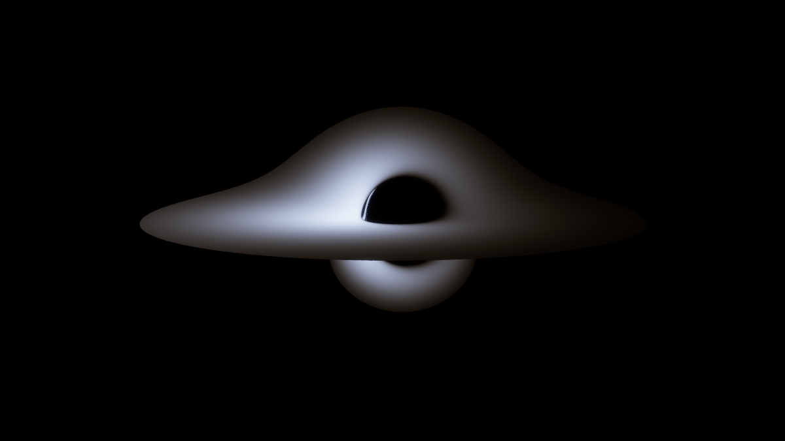
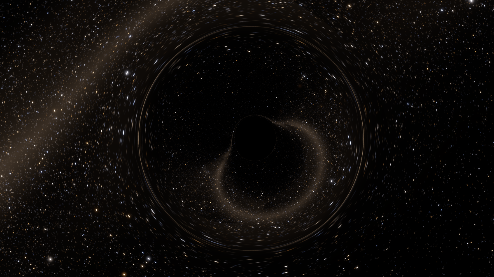
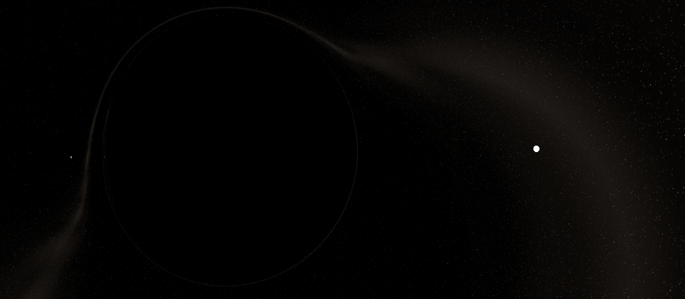
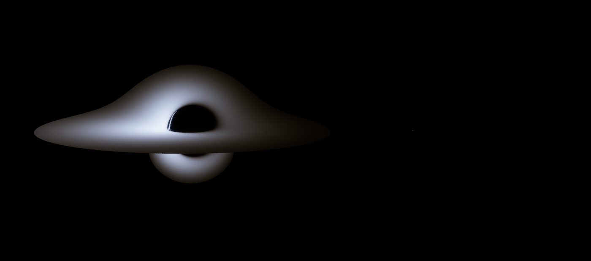
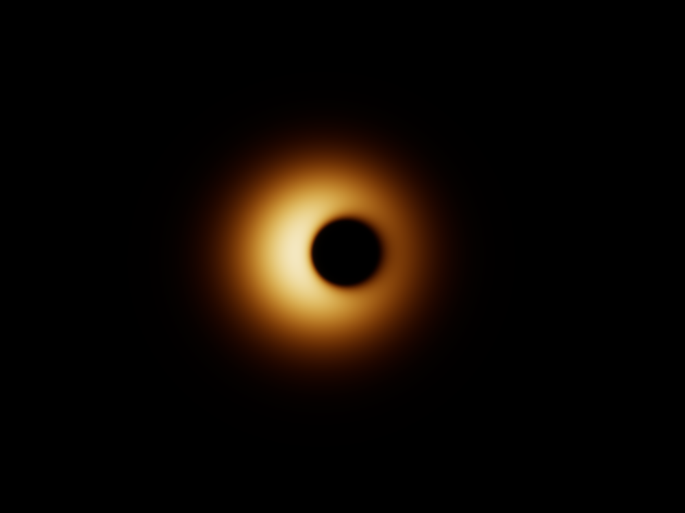
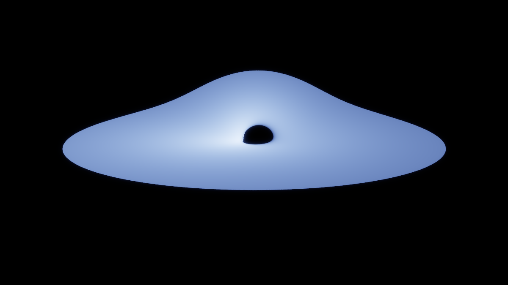
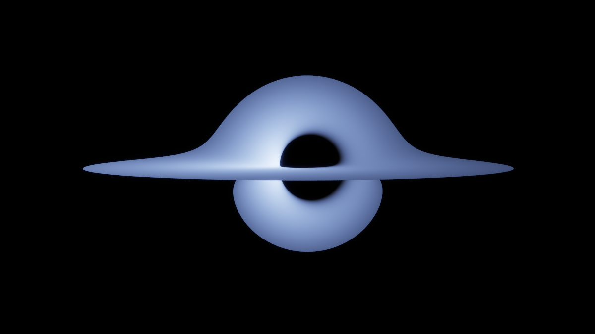

# blackhole

A general-relativistic ray tracer for the Kerr spacetime, in C++17, with no
dependencies beyond the standard library.

Light is transported by integrating null geodesics of Einstein's field
equations. Nothing about the image is faked: the shadow, the Einstein ring, the
warped disc, the Doppler asymmetry and the colours all fall out of the physics.

```
make
./blackhole --test                       # verify the physics
./blackhole --preset sgra --sun          # render, with the Sun for scale
```



---

## What it actually computes

### The spacetime

The Kerr metric is the unique stationary, axisymmetric, asymptotically flat
vacuum solution of

$$R_{\mu\nu} - \tfrac12 R\, g_{\mu\nu} = 8\pi T_{\mu\nu}, \qquad T_{\mu\nu}=0$$

In Boyer–Lindquist coordinates $(t, r, \theta, \phi)$ with $G = c = M = 1$:

$$ds^2 = -\Big(1-\frac{2r}{\Sigma}\Big)dt^2 - \frac{4ar\sin^2\theta}{\Sigma}\,dt\,d\phi + \frac{\Sigma}{\Delta}dr^2 + \Sigma\, d\theta^2 + \frac{A\sin^2\theta}{\Sigma}d\phi^2$$

with $\Sigma = r^2 + a^2\cos^2\theta$, $\Delta = r^2 - 2r + a^2$ and
$A = (r^2+a^2)^2 - a^2\Delta\sin^2\theta$. That is the *only* thing about the
gravity that is put in by hand — and the test suite verifies numerically that
it satisfies $R_{\mu\nu} = 0$ (see below).

### Light transport

Rather than integrating the second-order geodesic equation with its forty
Christoffel symbols, the tracer integrates the equivalent Hamiltonian system.
With $H = \tfrac12 g^{\mu\nu}(x)\, p_\mu p_\nu$,

$$\frac{dx^\mu}{d\lambda} = g^{\mu\nu}p_\nu, \qquad \frac{dp_\mu}{d\lambda} = -\tfrac12 \big(\partial_\mu g^{\alpha\beta}\big) p_\alpha p_\beta$$

Because Kerr is stationary and axisymmetric, $\partial_t g^{\alpha\beta} =
\partial_\phi g^{\alpha\beta} = 0$, so the equations for $p_t$ and $p_\phi$ read
$\dot p_t = \dot p_\phi = 0$: the energy $E = -p_t$ and the axial angular
momentum $L_z = p_\phi$ are conserved *to machine precision, exactly, with zero
drift*, for free. Only $\partial_r g^{\alpha\beta}$ and
$\partial_\theta g^{\alpha\beta}$ are ever needed, and both are supplied in
closed form.

The two remaining integrals — the null condition $g^{\alpha\beta}p_\alpha p_\beta
= 0$ and Carter's constant $Q$ — are deliberately **not** imposed. They are left
free and used as independent accuracy diagnostics, reported after every render.

Integration is Dormand–Prince 5(4) with PI step-size control and 5th-order dense
output, which lets disc crossings and surface hits be located to sub-step
accuracy rather than snapped to a step boundary.

Rays are traced **backwards** from the camera. The camera's image plane is
defined in its own orthonormal ZAMO tetrad, so relativistic aberration and the
gravitational distortion of the local sky are automatic consequences of using
that frame — there is no separate "aberration pass".

### The accretion disc

A Novikov–Thorne (1973) thin disc: geometrically thin, optically thick, each
annulus on a circular Keplerian geodesic, inner edge at the ISCO with a
zero-torque boundary condition. The radiated flux follows from conservation of
rest mass, angular momentum and energy (Page & Thorne 1974):

$$F(r) = \frac{\dot M}{4\pi r}\,\frac{-\,d\Omega/dr}{(E-\Omega L)^2}\int_{r_{\rm isco}}^{r}(E-\Omega L)\,\frac{dL}{dr'}\,dr'$$

with $E(r)$, $L(r)$, $\Omega(r)$ the specific energy, specific angular momentum
and angular velocity of an equatorial circular Kerr geodesic. The integral is
evaluated with Page & Thorne's closed form; the test suite re-derives it by
brute-force quadrature and the two agree to $1.5\times10^{-12}$.

The effective temperature is $T(r) = (F/\sigma)^{1/4}$, and the accretion rate is
set as a fraction of the Eddington rate using the disc's own radiative
efficiency $\eta = 1 - E(r_{\rm isco})$ (5.7% for $a=0$, 32% at $a = 0.998$ —
against 0.7% for hydrogen fusion).

### Colour and brightness

There is no colour ramp anywhere in this program.

The photon occupation number $I_\nu/\nu^3$ is a Lorentz invariant conserved
along a null geodesic. A blackbody of temperature $T_{\rm emit}$ therefore
arrives at the camera as an **exact blackbody** at

$$T_{\rm obs} = g\,T_{\rm emit}, \qquad g = \frac{(p\cdot u)_{\rm obs}}{(p\cdot u)_{\rm emit}}$$

with no extra factor — the familiar $g^4$ boost of the bolometric intensity is
already contained in the $\sigma T^4$ scaling of the Planck function.
Gravitational redshift, transverse and longitudinal Doppler shift and
relativistic beaming are all inside that single number.

So the renderer only ever asks for the colour of a blackbody at $g\,T$, and gets
it by integrating the Planck spectral radiance against the CIE 1931 2° standard
observer, then converting to sRGB. Disc, Sun and stars all end up on one
absolute radiometric scale in W m⁻² sr⁻¹, so their relative brightness in the
frame is the real one.

The consequence is a dynamic range of about **twelve orders of magnitude**
between an accretion disc and a sixth-magnitude star. That is not a bug — you
genuinely cannot see stars next to a bright accretion disc. Only the *display*
transform (exposure and tone curve, `--tonemap`, `--exposure`) compresses that
range for a screen; nothing in it feeds back into the simulation.

### The sky

250 000 stars, drawn from the observed cumulative count $\log N(<m) \sim 0.45m$,
with colour temperatures from B–V indices, plus a diffuse Milky Way at its real
surface brightness of 21.5 mag arcsec⁻². Stars are looked up with the *final*
direction of each traced geodesic, so the lensing — Einstein ring, secondary
images, the swirl of the frame-dragged photon ring — is exact, not a
post-process.



---

## The Sun, for scale

`--sun` puts the Sun in the frame at the **same distance from the camera** as
the black hole. That is the only placement for which comparing their apparent
sizes is a comparison of their real sizes. It is rendered as a real body: a
sphere of radius 6.957 × 10⁸ m radiating as a 5772 K blackbody with Eddington's
grey limb-darkening law $I(\mu)/I(1) = (2+3\mu)/5$, its own surface
gravitational redshift included, and its light bent by the black hole exactly
like everything else — the Sun is intersected against the traced geodesic, not
against a straight line.



*Sagittarius A\* and the Sun, at the same distance from the camera, so this is
their true relative size: the shadow is 47× wider. The disc is switched off here
so the shadow is silhouetted against the lensed star field instead; the ring
outlining it is the Einstein ring. Rendered with `--tonemap log --log-decades
13`, because the Sun's photosphere outshines the background stars by eleven
orders of magnitude and no single linear exposure can hold both.*



*The same comparison with the accretion disc on. The disc is much larger than
the shadow, so the frame has to be wider and the Sun shrinks to a few pixels on
the right — still at its true relative size.*

The program prints the numbers too:

```
  radius ratio         shadow / Sun  =  47.39
  volume ratio         shadow / Sun  =  1.064e+05
  apparent diameter    black hole 3.968 deg,  Sun 0.08064 deg
```

The comparison lands very differently depending on the hole:

| black hole | mass | shadow diameter | vs the Sun |
|---|---|---|---|
| stellar (X-ray binary) | 10 M☉ | 153 km | Sun is **9 000×** wider |
| Sagittarius A* | 4.3 × 10⁶ M☉ | 6.6 × 10⁷ km | shadow is **47×** wider |
| M87* | 6.5 × 10⁹ M☉ | 1.0 × 10¹¹ km | shadow is **72 000×** wider — 667 AU |

For the stellar-mass case the hole is genuinely smaller than a pixel next to the
Sun, and the program says so rather than quietly cheating the scale.

---

## Video

There is a constraint here worth stating before the how-to, because it decides
the whole design: **a Novikov–Thorne disc is stationary and axisymmetric.**
Nothing about it depends on `t` or on `φ`. So orbiting the camera in azimuth,
or "spinning the disc", produces 240 pixel-identical frames. Something has to
genuinely break the symmetry.

Two things can:

**An orbiting hot spot** (`--hotspot R`) — a compact brightness enhancement
carried around on a circular Keplerian geodesic. This is not invented for the
demo: GRAVITY has watched exactly this near Sgr A*, flares tracing loops on the
sky with 30–70 minute periods.


The timing is the interesting part. Each ray already carries the coordinate time
it took to arrive (negative — it is traced into the past), so the emission time
is just `t_emit = t_observer + y[Y_T]`, and the spot is placed where it *was*
then. Light bending means a photon that loops around the hole arrives much later
than one that came straight, so the secondary image shows the spot at an earlier
orbital phase than the primary. That echo falls straight out of integrating `t`
alongside everything else. At the default camera distance the light crossing time
is comparable to the orbital period, so the lag is a visible fraction of a cycle.

**Moving the camera in `θ` or `r`** — the two directions that are not symmetry
directions:


```bash
# 10 seconds, 24 fps, two orbits of a hot spot — self-contained animated PNG
./blackhole --preset sgra --inclination 60 --fov 34 \
    --hotspot 9 --hotspot-size 1.1 --hotspot-contrast 200 \
    --orbits 2 --duration 10 --fps 24 \
    --width 400 --height 300 --spp 1 --no-stars \
    --out video/hotspot-orbit.apng

# face-on to edge-on
./blackhole --preset sgra --inclination 4 --inclination-to 89 --fov 34 \
    --duration 10 --fps 24 --width 480 --height 300 --spp 1 --no-stars \
    --out video/inclination-sweep.apng
```

`.apng` writes a self-contained animated PNG that plays in any browser, using
the same DEFLATE encoder as the stills — no ffmpeg needed. **Any other
extension writes a numbered PNG sequence** and prints the ffmpeg command for an
mp4:

```bash
./blackhole --preset sgra --hotspot 9 --duration 10 --fps 24 \
    --width 1280 --height 720 --spp 2 --out frames/f_%04d.png
ffmpeg -framerate 24 -i frames/f_%04d.png -c:v libx264 -pix_fmt yuv420p -crf 18 out.mp4
```

The program reports what the film means physically:

```
  Hot spot
  orbital radius       9.00 M   (ISCO is at 2.32 M)
  orbital period       178.7 GM/c^3  =  63.1 minutes
  orbital speed        0.3333 c (as measured by a local static observer)
  sequence covers      2 orbits  =  7.5678e+03 s of real time
  played over          10.00 s at 24 fps  ->  757 x faster than real time
```

That period scales with mass exactly as it should: 63 minutes for Sgr A\*,
55 days for M87\*, 7.3 milliseconds for a 10 M☉ hole.

Two details that matter for animation. **Exposure is metered once and locked**
for the whole sequence — metering per frame would make the film flicker, and
worse, would suppress the very brightness variation the hot spot is there to
show. And a pure hot-spot sequence divides the phase by the frame count rather
than by count − 1, so the last frame does not duplicate the first and the loop
is seamless; a camera sweep is not periodic and does reach its endpoint exactly.

Cost is the obvious catch: a 10-second film is 150–240 renders, roughly 15
minutes on four cores. Keep `--spp 1` and a small `--width` while you find the
shot.

On file size: APNG is a still-image format pressed into service, so the encoder
works to keep it honest. Each frame stores **only the rectangle that changed**
(`fcTL` sub-frames with `dispose_op = NONE`, `blend_op = SOURCE`) — for the hot
spot, where a small bright blob moves across a static disc, that is about 7% of
the canvas per frame. And the DEFLATE stage builds **dynamic Huffman codes**
from the actual symbol statistics rather than using the fixed tables, which
lands within a few percent of `zlib -9`. Together those took the two films from
8 MB and 12 MB down to 1.8 MB and 4.4 MB, with no loss — every composited frame
is still byte-identical to the corresponding standalone render.

That is about as far as a lossless intraframe format goes. For anything
size-critical, write a PNG sequence and let ffmpeg apply a real video codec;
H.264 will beat this by another order of magnitude.

One check worth mentioning, because it validates the whole time pipeline at
once: the hot-spot film covers exactly two orbits in 240 frames, so the period
is exactly 120 frames — and frames 0 and 120 come out **byte-identical**, as do
30 and 150. Frame 239 differs from frame 0 by about as much as frame 1 does, so
the loop is seamless with no duplicated frame.

---

## Verification

`./blackhole --test` runs 40 checks. It is the point of the project as much as
the pictures are.

### Einstein's equations, checked numerically

The Ricci tensor is assembled from the metric components alone — fourth-order
finite differences into Christoffel symbols, then into the Riemann tensor — with
no analytic shortcut. For a vacuum solution it must vanish:

```
[PASS] Kerr satisfies R_{mu nu} = 0 (numerically, from g)
       max |R_mn| / (curvature scale) = 3.75e-09
[PASS] Riemann tensor reproduces the analytic Kretschmann scalar
       max relative error = 6.22e-09
[PASS] curvature is finite at the event horizon    K(r=2M) = 0.750000 = 48/64
```

That last one is the statement that the horizon is not a singularity — the
Kretschmann scalar $K = R_{abcd}R^{abcd}$ is perfectly finite there, and the
apparent blow-up of $g_{rr}$ is an artefact of the coordinates.

### Mercury

A timelike geodesic of the real Sun's Schwarzschild field, with Mercury's real
orbital elements, integrated for one radial period:

```
[PASS] Mercury's anomalous perihelion advance
       integrated 42.971"/century  (GR formula 42.982", observed 42.98 +/- 0.04")
```

### Light bending

The traced geodesic is compared against an exact one-dimensional quadrature of
$d\phi/du = (b^{-2} - u^2 + 2Mu^3)^{-1/2}$, and that quadrature is separately
checked against Einstein's $4GM/c^2b$:

```
[PASS] traced geodesic matches the exact deflection integral
       b = 20 M: traced 3.377328649 rad, exact quadrature 3.377328649 rad
[PASS] light deflection tends to 4GM/(c^2 b)
       b = 1e+04 M: exact 4.0011788949e-04 rad, 4M/b = 4.0000000000e-04
[PASS] shadow radius is the critical impact parameter 3 sqrt(3) M
       b_crit = 5.19615242 M vs 3 sqrt(3) = 5.19615242 M
```

### Everything else

| what | result |
|---|---|
| $g^{\mu\nu}g_{\nu\lambda} = \delta^\mu_\lambda$ | 5.6e-16 |
| photons stay null along the ray | 3.0e-11 |
| Carter's constant conserved | 8.7e-11 |
| energy $E = -p_t$ conserved | **exactly zero drift** |
| ISCO: 6M (a=0), 1M/9M (extremal) | exact |
| photon sphere: 3M (a=0), 1M/4M (extremal) | exact |
| ZAMO has $u_\phi = 0$ | 1.1e-16 |
| Page–Thorne closed form vs direct quadrature | 1.5e-12 |
| disc luminosity $= \eta\dot Mc^2$ | agrees to 6 significant figures |
| $\int B_\lambda\,d\lambda = \sigma T^4/\pi$ | 3.2e-11 |
| Wien's displacement law | 2.5e-05 |
| Doppler factor → $1/\gamma(1\mp v)$ far out | 3.2e-05 |
| Sgr A* shadow vs EHT (51.8 ± 2.3 µas) | predicts 53.3 µas |
| M87* shadow vs EHT (42 ± 3 µas) | predicts 39.7 µas |

Every render also reports its own accuracy:

```
  worst |g^ab p_a p_b|  2.25e-09   (photons should stay exactly null)
  worst drift in Q      5.74e-07   (Carter's constant)
```

---

## Gallery

| | |
|---|---|
|  |  |
| **M87\***, 17° from the spin axis — nearly face-on, so the Doppler asymmetry is weak and the ring is almost round. The orange is a real colour: a few-thousand-kelvin disc. | **Stellar-mass X-ray binary**, 10 M☉ at 0.1 Eddington. The disc peaks at 7 × 10⁶ K, so its emission is X-ray and only the blue Rayleigh–Jeans tail is visible. |
|  |  |
| **10⁸ M☉ at a = 0.999, seen 3° from edge-on.** The "hump" above the shadow is the *far* side of the disc, lensed up and over the hole; the arc below it is the same far side seen through the underside. | **Sagittarius A\***, 8° from edge-on. The left side is brighter because it is approaching: at the inner disc the beaming contrast is about 8:1. |

---

## Usage

```
SCENE
  --preset NAME        sgra | m87 | stellar | gargantua | custom
  --mass MSUN          black hole mass in solar masses
  --spin A             dimensionless spin a/M in [-0.9999, 0.9999]
  --distance R         camera distance in gravitational radii GM/c^2
  --inclination DEG    viewing angle from the spin axis (90 = edge on)
  --fov DEG            horizontal field of view

DISC
  --no-disc            switch the accretion disc off
  --disc-outer R       outer radius in gravitational radii
  --eddington F        accretion rate as a fraction of the Eddington rate
  --retrograde         disc counter-rotates with respect to the hole

THE SUN
  --sun                add the Sun at the same distance as the black hole
  --sun-distance R     place the Sun this far from the hole instead

SKY
  --no-stars           empty background instead of a lensed star field
  --stars N            number of stars (default 250000)
  --seed N             random seed for the star field

IMAGE
  --width N  --height N
  --spp N              samples per pixel is N*N (default 2)
  --exposure X         exposure multiplier; omit for automatic
  --tonemap NAME       aces | reinhard | log | linear
  --glare X            veiling-glare strength in [0,1]
  --log-decades N      decades of radiance the "log" curve spans
  --out FILE           .png / .ppm, or .apng for a self-contained animation

ANIMATION
  --duration S         make a film S seconds long (with --fps sets the count)
  --frames N           or give the frame count directly
  --fps N              frames per second (default 24)
  --hotspot R          orbiting hot spot at radius R - the thing that moves
  --hotspot-contrast X peak brightness over the quiescent disc
  --hotspot-size S     Gaussian radius in GM/c^2
  --orbits N           hot-spot orbits covered by the sequence
  --inclination-to D   sweep the viewing angle to D degrees
  --distance-to R      sweep the camera distance to R
  --fov-to D           sweep the field of view to D degrees

  --out FILE           output file (.png or .ppm)

OTHER
  --threads N          worker threads (default: all cores)
  --test               run the physics validation suite and exit
```

Some things worth trying:

```bash
# retrograde disc: the ISCO moves out to 8.7M and the beaming flips sides
./blackhole --preset sgra --retrograde

# nearly extremal, nearly edge-on
./blackhole --spin 0.998 --inclination 89 --preset gargantua

# no disc, wide field: pure lensing of the star field
./blackhole --no-disc --fov 60 --stars 500000

# look down the spin axis
./blackhole --preset sgra --inclination 5
```

A note on `--glare`: it is a camera model, a convolution with a heavy-tailed
point spread function. Any such kernel is finite, and under a very wide display
stretch (`--tonemap log` with many decades) the edge of the kernel becomes
visible as a halo boundary around saturated sources. Use `--glare 0` for
wide-latitude renders.

Output is PNG, written by a self-contained encoder (CRC-32, Adler-32, and a
small DEFLATE with LZ77 and fixed Huffman codes) so there is no zlib or libpng
dependency. `.ppm` also works.

---

## Building

```bash
make            # or: cmake -B build && cmake --build build
make test       # the 40 physics checks
make images     # regenerate gallery/
make videos     # regenerate video/  (240 renders each, ~30 min)
```

Needs a C++17 compiler and pthreads. Nothing else. `-ffast-math` is
deliberately *not* used: the conservation checks depend on IEEE semantics, and
reassociating the geodesic right-hand side would quietly cost accuracy.

Cost is roughly 170 integration steps per ray. A 1200 × 675 frame at 9 samples
per pixel is about 7 × 10⁶ rays and takes a few minutes on four cores.

---

## What is modelled, and what is not

Honest list, because "real physics" should come with its boundaries.

**Modelled exactly.** The Kerr geometry; null and timelike geodesics; the event
horizon, ergosphere, photon sphere and ISCO; frame dragging; gravitational
lensing to arbitrary order, including higher-order images; gravitational
redshift; special-relativistic Doppler shift and beaming of orbiting matter;
Novikov–Thorne disc structure and its emitted flux; Planck emission with the CIE
colorimetry; solar limb darkening.

**Modelled approximately.**
- The disc is *stationary, axisymmetric and geometrically thin*. Real discs are
  turbulent, have finite scale height, and vary on the orbital timescale.
- Emission is *thermal blackbody* from the disc surface. For Sgr A* and M87\* the
  real emission is optically thin synchrotron from a hot, radiatively
  inefficient accretion flow, which is a different beast; the presets use a thin
  disc regardless, so the M87\* image here should be read as "what a thin disc
  would look like at that mass and inclination", not as a reproduction of the
  EHT observation. The *shadow size* is a pure geometry result and does match.
- Limb darkening is grey (wavelength-independent).
- The plunging region inside the ISCO is treated as transparent.

**Not modelled.** Radiative transfer through the disc or any intervening
medium — the spacetime is vacuum, so rays travel unabsorbed and unscattered
until they hit something. No jets, no corona, no magnetic fields, no
self-gravity of the disc, no time dependence. The Sun's own mass does not curve
spacetime here; light passing its limb would be deflected by 1.75″, which is
negligible at every scale in these images. No cosmological expansion.

---

## Layout

| file | contents |
|---|---|
| `src/kerr.h` | the metric, its inverse, analytic derivatives, horizons, ISCO, ZAMO tetrad |
| `src/geodesic.h` | Hamiltonian geodesic equations, Dormand–Prince 5(4) with dense output |
| `src/disc.h` | Novikov–Thorne / Page–Thorne accretion disc |
| `src/spectrum.h/.cpp` | Planck radiance → CIE 1931 → sRGB |
| `src/scene.h` | star field, the Sun, orbiting hot spot, camera |
| `src/render.cpp` | backwards ray tracing, event detection, shading |
| `src/image.h/.cpp` | tone mapping, the PNG encoder, and the APNG writer |
| `src/validate.cpp` | the 40 physics checks |
| `gallery/` | rendered stills (`make images`) |
| `video/` | rendered films (`make videos`) |

## References

- Kerr, *Phys. Rev. Lett.* **11**, 237 (1963) — the metric
- Carter, *Phys. Rev.* **174**, 1559 (1968) — the fourth integral
- Bardeen, Press & Teukolsky, *ApJ* **178**, 347 (1972) — ISCO, photon orbits
- Novikov & Thorne (1973); Page & Thorne, *ApJ* **191**, 499 (1974) — thin discs
- Luminet, *A&A* **75**, 228 (1979) — the first rendering of a lensed disc
- Hairer, Nørsett & Wanner, *Solving ODEs I* — the integrator and its dense output
- Wyman, Sloan & Shirley, *JCGT* **2**(2) (2013) — CIE colour matching fits
- Event Horizon Telescope Collaboration (2019, 2022) — M87\* and Sgr A\*
